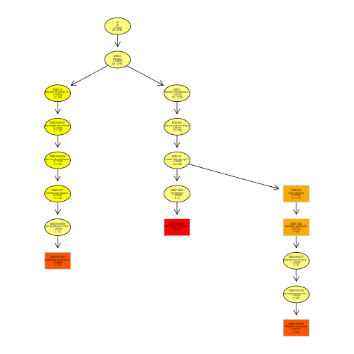

# Overview
TopOnto package provides tools for testing ontlogy terms while accounting for the topology of the ontology graph. It is designed to facilitate semi-automated enrichment analysis for any GO-like ontologies. Different test statistics and different methods for eliminating local similarities and dependencies between ontology terms can be implemented and applied. TopOnto package does exactly the same job as the topGO package. The difference is that topOnto accept customize ontologies while topGO only support Gene Ontology.


There are a number of test statistics and algorithms dealing with the ontology graph structured ready to use in *TopOnto*. Table~\ref{tabletopGO} presents the compatibility table between the test statistics and GO graph methods.

<center>


```
## Creating a generic function for 'print' from package 'base' in package 'topOnto'
```


|            |fisher                                                    |ks                                                        |t                                                         |globaltest                                                |sum                                                       |
|:-----------|:---------------------------------------------------------|:---------------------------------------------------------|:---------------------------------------------------------|:---------------------------------------------------------|:---------------------------------------------------------|
|classic     | | | | | |
|elim        | | | | | |
|weight      | |   |   |   |   |
|weight01    | | | | | |
|lea         | | | | | |
|parentchild | |   |   |   |   |
</center>


The **elim** and **weight** algorithms were introduced in~\cite{Alexa2006}. The default algorithm
used by the **topOnto** package is a mixture between the **elim** and the **weight** algorithms and
it will be referred as **weight01**. The **parentChild** algorithm was introduced by~\cite{Grossmann2007}.

We assume the user has a good understanding of what ontology is and is familiar with enrichment tests. 
Also this document requires basic knowledge of R language.

The next section presents a quick tour into **topOnto** and is thought to be independent of the rest
of this manuscript. The remaining sections provide details on the functions used in the sample
section as well as showing more advance functionality implemented in the **topOnto** package.


# Instalation


```r
#library(topOnto)
#help(topOnto)
```

# Quick start guide
This section describes a simple working session using **topOnto**. There are only a handful of commands
necessary to perform a gene set enrichment analysis which will be briefly presented below.

A typical session can be divided into three steps:

1.  *Data preparation* List of genes identifiers, gene scores, list of differentially expressed genes
  or a criteria for selecting genes based on their scores, as well as gene-to-ontology annotations are all collected
  and stored in a single *R* object.
  
2.  *Running the enrichment tests* Using the object created in the first step the user can perform
  enrichment analysis using any feasible mixture of statistical tests and methods that deal with the ontology topology.
  
3.  *Analysis of the results* The results obtained in the second step are analysed using 
  summary functions and visualisation tools.

## Data preparation
In the first step a convenient *R* object of class *topONTdata* is created containing all the
information required for the remaining two steps. The user needs to provide the gene universe, ontology annotations
and either a criteria for selecting interesting genes (e.g. differentially expressed genes) from the gene
universe or a score associated with each gene.

In this session we will test the enrichment of human disease ontology(HDO) terms with differentially expressed genes. Thus, the 
starting point is a list of genes and their annotation data.


```r
library(topOnto)
## Load Annotation and gene list
data(ONTdata)
```

topOnto use a set of db packages to construct the ontoloy data. These ontology db packages can be build by using the obtology standard obo file 
and the scripts(inst/scripts/create.db) come with the topOnto package. We want to use HDO for the analysis. 

```r
##find out what ontology packages are currently available in your R library
topOnto::initWHAT()
##load the HDO package
topOnto::initONT('HDO')
```

We now have all data necessary to build an object of type *topONTdata*. This object will
contain all gene identifiers and the HDO annotations, the HDO hierarchical structure
and all other information needed to perform the desired enrichment analysis. 


```r
GOdata <- new("topONTdata", ontology = "HDO", allGenes = geneList,annot = annFUN.gene2GO, gene2GO = geneID2TERM)
```

```
## 
## Building most specific terms .....	( 1135 terms found. )
## 
## Build DAG topology ..........	( 1513 terms and 1564 relations. )
## 
## Annotating nodes ...............	( 2781 genes annotated to the terms. )
```

The names of the arguments used for building the *topONTdata* object should be self-explanatory. 
We quickly mention that *nodeSize = 10* is used to prune the GO hierarchy from the terms
which have less than $10$ annotated genes and that *annFUN.db* function is used to extract the 
gene-to-ontology mappings from the *geneID2TERM* object. See detail of the parameters used to build the *topONTdata* later.

A summary of the *GOdata* object can be seen by typing the object name at the R prompt.
Having all the data stored into this object facilitates the access to identifiers, annotations and 
to basic data statistics.


```r
GOdata
```

```
## 
## ------------------------- topONTdata object -------------------------
## 
##  Description:
##    -   
## 
##  Ontology:
##    -  HDO 
## 
##  2823 available genes (all genes from the array):
##    - symbol:  2 12 16 19 22  ...
##    - 28  significant genes. 
## 
##  2781 feasible genes (genes that can be used in the analysis):
##    - symbol:  2 12 16 19 22  ...
##    - 28  significant genes. 
## 
##  Graph (nodes with at least  1  genes):
##    - a graph with directed edges
##    - number of nodes = 1513 
##    - number of edges = 1564 
## 
## ------------------------- topONTdata object -------------------------
```


## Performing the enrichment tests
Once we have an object of class *topONTdata* we can start with the enrichment analysis. 
We will use one test statistics: Fisher's exact test which is based on gene counts. 

The function *runTest* is used to apply the specified test statistic and method to the data.
It has three main arguments. The first argument needs to be an object of class *topONTdata*.
The second and third argument are of type character; they specify the method for dealing with
the ontology graph structure and the test statistic, respectively.

First, we perform a classical enrichment analysis by testing the over-representation of HDO terms. 
For the method *classic* each HDO category is tested independently.  
We will test the enrichment using *classic* and *elim* with *Fisher exact test*.


```r
resultFis <- runTest(GOdata, algorithm = "classic", statistic = "fisher")
```

```
## 
## 			 -- Classic Algorithm -- 
## 
## 		 the algorithm is scoring 109 nontrivial nodes
## 		 parameters: 
## 			 test statistic:  fisher
```

```r
resultElimFis<- runTest(GOdata, algorithm = "elim", statistic = "fisher")
```

```
## 
## 			 -- Elim Algorithm -- 
## 
## 		 the algorithm is scoring 109 nontrivial nodes
## 		 parameters: 
## 			 test statistic:  fisher 
## 			 cutOff:  0.01 
## 
## 	 Level 10:	4 nodes to be scored	(0 eliminated genes)
## 
## 	 Level 9:	11 nodes to be scored	(24 eliminated genes)
## 
## 	 Level 8:	17 nodes to be scored	(24 eliminated genes)
## 
## 	 Level 7:	20 nodes to be scored	(52 eliminated genes)
## 
## 	 Level 6:	19 nodes to be scored	(99 eliminated genes)
## 
## 	 Level 5:	16 nodes to be scored	(198 eliminated genes)
## 
## 	 Level 4:	14 nodes to be scored	(198 eliminated genes)
## 
## 	 Level 3:	6 nodes to be scored	(198 eliminated genes)
## 
## 	 Level 2:	1 nodes to be scored	(198 eliminated genes)
## 
## 	 Level 1:	1 nodes to be scored	(198 eliminated genes)
```

*runTest* returns an object of class *topONTresult*. A short summary of this object is shown below.

```r
resultFis 
```

```
## 
## Description:  
## Ontology: HDO 
## 'classic' algorithm with the 'fisher' test
## 1513 GO terms scored: 13 terms with p < 0.01
## Annotation data:
##     Annotated genes: 2781 
##     Significant genes: 28 
##     Min. no. of genes annotated to a GO: 1 
##     Nontrivial nodes: 109
```

```r
resultElimFis
```

```
## 
## Description:  
## Ontology: HDO 
## 'elim' algorithm with the 'fisher : 0.01' test
## 1513 GO terms scored: 5 terms with p < 0.01
## Annotation data:
##     Annotated genes: 2781 
##     Significant genes: 28 
##     Min. no. of genes annotated to a GO: 1 
##     Nontrivial nodes: 109
```

##Analysis of results
After the enrichment tests are performed the researcher needs tools for analysing and interpreting the
results. *GenTable* is an easy to use function for analysing the most significant GO terms and the
corresponding *p-values*. In the following example, we list the top *10* significant HDO terms identified 
by the *elim* method. At the same time we also compare the ranks and the p-values of these HDO terms
with the ones obtained by the *classic* method.


```r
allRes <- GenTable(GOdata, classicFisher = resultFis, 
                   elimFisher = resultElimFis,
                   orderBy = "elimFisher", ranksOf = "classicFisher", topNodes = 10)
```
The *GenTable* function returns a data frame containing the top *topNodes* HDO terms identified
by the *elim* algorithm, see *orderBy* argument. The data frame includes some statistics on the
HDO terms and the *p-values* corresponding to each of the *topONTresult* object specified as arguments.
<center>

|TERM.ID      |Term                                        | Annotated| Significant| Expected| Rank in classicFisher|classicFisher |elimFisher |
|:------------|:-------------------------------------------|---------:|-----------:|--------:|---------------------:|:-------------|:----------|
|DOID:0050635 |alternating hemiplegia of childhood         |         2|           2|     0.02|                     4|9.8e-05       |9.8e-05    |
|DOID:0050709 |Ohtahara syndrome                           |        24|           3|     0.24|                     6|0.0016        |0.0016     |
|DOID:0060307 |autosomal dominant non-syndromic intelle... |        29|           3|     0.29|                     9|0.0028        |0.0028     |
|DOID:1826    |epilepsy syndrome                           |        69|           6|     0.69|                     2|4.6e-05       |0.0073     |
|DOID:936     |brain disease                               |       170|          10|     1.71|                     1|2.8e-06       |0.0079     |
|DOID:0050606 |acrokeratosis verruciformis                 |         1|           1|     0.01|                    14|0.0101        |0.0101     |
|DOID:0050835 |generalized dystonia                        |         1|           1|     0.01|                    15|0.0101        |0.0101     |
|DOID:0060160 |survival motor neuron spinal muscular at... |         1|           1|     0.01|                    16|0.0101        |0.0101     |
|DOID:0060170 |generalized epilepsy with febrile seizur... |         1|           1|     0.01|                    17|0.0101        |0.0101     |
|DOID:0060175 |succinic semialdehyde dehydrogenase defi... |         1|           1|     0.01|                    18|0.0101        |0.0101     |
</center>

Another insightful way of looking at the results of the analysis is to investigate how
the significant HDO terms are distributed over the HDO graph.
The plotted graph is the upper induced graph generated by these significant nodes. 

<center>

```r
showSigOfNodes(GOdata, score(resultElimFis), firstSigNodes = 5, useInfo = 'all')
```

 
</center>

# Conclusion
The above vegnette shows how to use the topOnto package. 
topOnto package is developed on the topGO package so the analyces are the same as topGO. The only different is that you need to load an ontology package at the beginning. Please have a look at the topGO manu for more detail.


